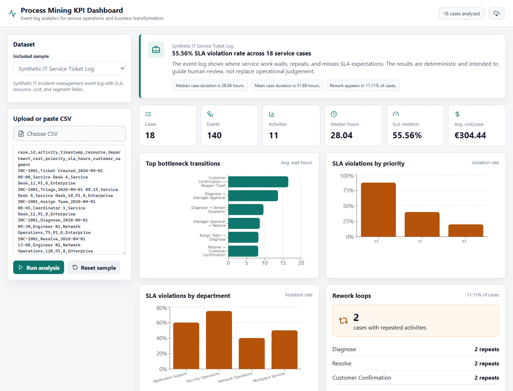
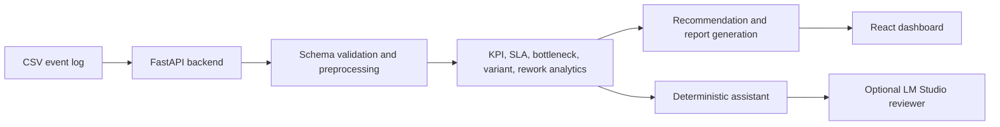

# Process Mining KPI Dashboard

A local process-mining and KPI dashboard for IT service ticket event logs. The project demonstrates event-log analytics, SLA monitoring, bottleneck detection, variant analysis, rework analysis, and executive reporting in a consulting-style dashboard.



## Portfolio Relevance

This repo shows how raw operational event logs can be turned into management-ready insights. It is relevant for technology consulting, operations transformation, AI/data analytics, and business process improvement roles because it combines data engineering, process mining, KPI design, and dashboard delivery.

## Why Process Mining Matters

Business transformation teams often need to understand how work actually flows, not only how a process is documented. Event logs make it possible to quantify delays, process variation, SLA leakage, and rework so improvement discussions are grounded in evidence.

## Demo in 3 Minutes

```powershell
python -m venv .venv
.\.venv\Scripts\Activate.ps1
pip install -r backend\requirements.txt
python -m uvicorn backend.app.main:app --reload --port 8020
```

In a second terminal:

```powershell
cd frontend
npm.cmd install
npm.cmd run dev
```

Open `http://127.0.0.1:5174`. The included synthetic IT service event log loads automatically. The Vite dev server proxies `/api` requests to the backend on port `8020`.

## Architecture



## Dataset

The default dataset is `data/sample_event_log.csv`, a synthetic IT incident-management event log with:

- `case_id`
- `activity`
- `timestamp`
- `resource`
- `department`
- `cost`
- `priority`
- `sla_hours`
- `customer_segment`

No private, university-restricted, or client data is included.

## Use Your Own CSV

Your CSV must include the same columns listed above. Then either:

- paste the CSV into the dashboard sidebar, or
- upload the CSV file through the sidebar.

You can validate a file from the command line:

```powershell
python scripts\validate_event_log.py path\to\event_log.csv
```

## Optional Public Event Logs

Large public event logs are not downloaded automatically and should not be committed to git. Useful sources include:

- [processmining.org event logs](https://www.processmining.org/event-data.html)
- Hospital Billing
- Sepsis Cases
- Road Traffic Fine Management
- BPI Challenge 2019/2020 logs

If you manually download XES logs, install PM4Py only when needed:

```powershell
pip install pm4py
python scripts\convert_xes_to_csv.py data\raw\example.xes.gz data\external\example_converted.csv
```

See `docs/public_event_logs.md` for usage notes.

## Optional LM Studio Assistant

The analytics and dashboard work without an LLM. The assistant uses deterministic templates by default.

To test a local OpenAI-compatible endpoint:

1. Start the LM Studio local server.
2. Copy `.env.example` to `.env`.
3. Set:

```env
LLM_MODE=openai_compatible
OPENAI_BASE_URL=http://127.0.0.1:1234/v1
OPENAI_API_KEY=lm-studio
OPENAI_MODEL=local-model
```

Replace `local-model` with the model id shown by LM Studio and restart the backend.

## Tests

```powershell
python -m pytest
cd frontend
npm.cmd test
npm.cmd run build
```

## Limitations

- Activity duration is estimated from inter-event elapsed time, not start/end timestamps for each activity.
- SLA root-cause views show associations, not causal proof.
- Public XES logs may require manual schema mapping for richer resource, cost, SLA, or segment fields.
- The optional LLM assistant explains metrics but does not calculate or override analytics.

## Future Work

- Add richer PM4Py process discovery outputs.
- Support multi-dataset comparison.
- Add drill-down views by case and resource.
- Add automated anomaly detection for unusual variants.
